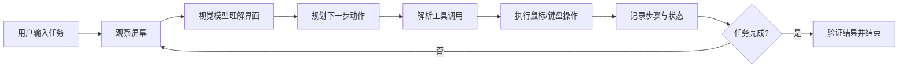
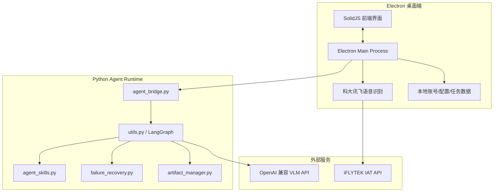
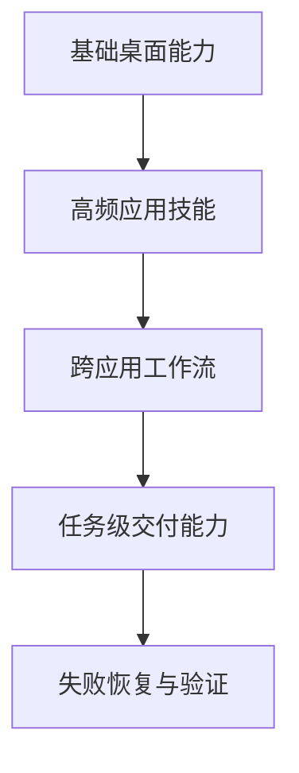

<h1 align="center">🖥️ 跨应用自动化执行 Agent</h1>

<p align="center">
  <strong>基于视觉语言模型、多步骤规划、Electron 桌面端与 Windows 自动化能力的跨应用任务执行系统</strong>
</p>

<p align="center">
  
  
  
  
  
  
</p>

<p align="center">
  <a href="#-核心亮点">核心亮点</a> ·
  <a href="#-快速开始">快速开始</a> ·
  <a href="#-桌面端功能">桌面端功能</a> ·
  <a href="#-系统架构">系统架构</a> ·
  <a href="#-打包发布">打包发布</a>
</p>

---

## 🌟 项目简介

**跨应用自动化执行 Agent** 是一个面向 Windows 桌面环境的智能自动化系统。用户只需要输入自然语言任务，Agent 会观察屏幕、理解界面、规划步骤，并像人一样操作鼠标和键盘，在浏览器、微信、QQ、邮箱、WPS、Office、资源管理器等应用之间完成跨应用任务。

典型任务示例：

```text
上 Edge 浏览器查看今日金价，将内容总结成 docx 报告，最终通过网易邮箱发送给 1083256791@qq.com
```

```text
打开微信，搜索文件传输助手，把桌面上的报告发送过去。
```

```text
每天上午 9 点自动打开浏览器查询行业新闻，并生成简要报告。
```

---

## ✨ 核心亮点

| 能力 | 说明 |
|---|---|
| 👁️ 屏幕观察 | 自动截图并交给视觉语言模型理解当前桌面状态 |
| 🧠 多步骤规划 | 将复杂任务拆解为可执行步骤，持续观察、决策和修正 |
| 🖱️ 桌面执行 | 调用 PyAutoGUI 执行点击、输入、快捷键、滚动、等待等操作 |
| 🧩 Skill 分层能力 | 内置桌面、浏览器、微信、QQ、报告交付、跨应用流程等技能模块 |
| 🛟 失败恢复 | 对动作失败、解析失败、循环风险进行恢复和终止控制 |
| 🧾 报告与文件流 | 支持任务产物目录、文件查找、报告交付和截图自动清理 |
| 🎙️ 语音输入 | 接入科大讯飞实时语音听写 API，将语音任务转为文本指令 |
| ⏰ 定时任务 | 支持创建、启停、立即运行、执行中停止定时任务 |
| 👤 账号体系 | 支持本地注册、登录、免登录和用户数据隔离 |
| 🟢 悬浮状态球 | 执行中显示状态球，可拖动、可返回主界面，并减少透明区域遮挡 |
| 📦 Windows 安装包 | 支持打包为 `.exe` 安装包，普通用户可直接安装运行 |

---

## 🖼️ 产品体验

> 当前仓库未内置应用截图。建议在发布前将截图放入 `docs/images/`，并按下面路径替换占位图。

<p align="center">
  
</p>

<p align="center">
  <em>主界面：输入任务、语音输入、常用指令、执行状态一体化。</em>
</p>

<p align="center">
  
</p>

<p align="center">
  <em>执行过程：每一步展示屏幕观察、界面理解、桌面执行和失败详情。</em>
</p>

---

## 🧭 工作流



---

## 🧱 系统架构



---

## 📁 项目结构

```text
Qwen-Agent/
├── agent_bridge.py              # Electron 与 Python Agent 的 JSON Lines 桥接入口
├── utils.py                     # VLM 调用、LangGraph 状态图、截图和动作执行核心
├── agent_planner.py             # 任务规划与检查点设计
├── agent_skills.py              # 桌面、浏览器、QQ、报告交付等 Skill 能力
├── artifact_manager.py          # 任务产物、报告文件和输出目录管理
├── desktop_state.py             # Windows 桌面状态识别辅助
├── failure_recovery.py          # 失败原因解释、重试和恢复策略
├── run_gui_owl_1_5_for_pc.py    # 终端交互调试入口
├── requirements.txt             # Python Agent 依赖
├── scripts/
│   ├── build-agent.ps1          # 构建 Python Agent 可执行文件
│   └── package-windows.ps1      # 打包 Windows 安装包
└── desktop/
    ├── package.json             # Electron 桌面端依赖和打包配置
    ├── resources/agent/         # 打包后的 agent_bridge.exe
    └── src/
        ├── main/                # Electron 主进程、Python Runner、语音、账号、定时任务
        ├── preload/             # 安全暴露给前端的 IPC API
        └── renderer/            # SolidJS 前端界面
```

---

## 🚀 快速开始

### 1. 克隆项目

```powershell
git clone https://github.com/Oxygen-Bobo/Cross-Application-Automation-and-Execution-Agent-Based-on-VLM.git
cd Cross-Application-Automation-and-Execution-Agent-Based-on-VLM
```

### 2. 安装 Python 依赖

```powershell
pip install -r requirements.txt
```

### 3. 安装桌面端依赖

```powershell
cd desktop
npm install
```

### 4. 启动开发版桌面应用

```powershell
npm run dev
```

---

## ⚙️ API 配置

### 视觉模型 API

桌面应用中可在“账号与设置 / API 设置”页面配置：

| 配置项 | 说明 |
|---|---|
| API Key | OpenAI 兼容接口密钥 |
| Base URL | 例如 DashScope OpenAI 兼容接口地址 |
| Model Name | 例如 `qwen3-vl-plus` |
| Timeout / Retry | 请求超时和重试参数 |

> Electron 路径会将 API Key 通过环境变量传给 `agent_bridge.py`，避免命令行参数暴露。

### 科大讯飞语音识别 API

语音输入使用 **科大讯飞实时语音听写 WebAPI**。

配置位置：

```text
desktop/src/main/speech.ts
```

填写文件顶部常量：

```ts
const XFYUN_APP_ID = "你的 AppID";
const XFYUN_API_KEY = "你的 APIKey";
const XFYUN_API_SECRET = "你的 APISecret";
```

当前语音参数：

| 参数 | 当前值 |
|---|---|
| 接口 | `wss://iat-api.xfyun.cn/v2/iat` |
| 音频格式 | 16k / 16bit / mono PCM |
| 语言 | 中文普通话 |
| 动态修正 | 已处理 `wpgs` 的替换结果，避免重复文本 |

---

## 🖥️ 桌面端功能

| 页面 / 模块 | 功能 |
|---|---|
| 🏠 新建任务 | 输入自然语言任务、语音输入、执行任务 |
| 🧠 执行时间线 | 展示每一步观察、理解、执行、失败原因和耗时 |
| 🟢 悬浮状态球 | 执行中保持状态感知，支持拖动和返回主界面 |
| ⏰ 定时任务 | 创建周期任务，支持启停、立即运行和执行中停止 |
| 👤 账号与设置 | 本地账号注册登录、免登录、配置管理、用户数据隔离 |
| 💳 升级页面 | 展示 Basic / Pro 信息与支付二维码 |
| 🧰 常用指令 | 用户可编辑常用任务模板，一键填入输入框 |

---

## 🧩 Agent 能力设计

系统采用分层能力，而不是一次性堆砌“大而全”的软件知识库：



| 层级 | 示例 |
|---|---|
| 基础桌面能力 | 窗口切换、任务栏优先、桌面回退、输入、复制粘贴 |
| 高频应用技能 | 浏览器、微信、QQ、邮箱、WPS、资源管理器 |
| 跨应用工作流 | 查资料 → 写报告 → 找文件 → 发送 |
| 任务级交付 | 报告生成、附件发送、结果验证 |
| 恢复策略 | 错误解释、重试建议、死循环防护、停止任务 |

---

## 🔄 执行状态

每个任务按如下循环运行：

| 阶段 | 说明 |
|---|---|
| 👁️ 屏幕观察 | 截取当前屏幕，获取可见上下文 |
| ✦ 界面理解 | VLM 分析 UI 元素、窗口状态和任务进度 |
| ↗ 桌面执行 | 执行点击、输入、快捷键、等待或应用切换 |
| ✓ 结果验证 | 判断结果是否完成，避免未完成却显示成功 |

---

## 🛠️ 开发命令

### 启动桌面开发环境

```powershell
cd desktop
npm run dev
```

### 构建前端和主进程

```powershell
cd desktop
npm run build
```

### 构建 Python Agent

```powershell
powershell -ExecutionPolicy Bypass -File scripts\build-agent.ps1
```

### 打包 Windows 安装包

```powershell
powershell -ExecutionPolicy Bypass -File scripts\package-windows.ps1
```

输出路径：

```text
desktop/release/Desktop Agent-1.0.0-Setup.exe
```

---

## 📦 打包发布

发布版使用 Electron Builder 打包为 Windows NSIS 安装包。

打包内容包括：

| 内容 | 说明 |
|---|---|
| Electron 桌面应用 | 前端界面和主进程 |
| `agent_bridge.exe` | Python Agent 桥接程序 |
| 支付二维码资源 | 微信 / 支付宝二维码图片 |
| 本地数据目录 | 用户账号、配置、任务历史和定时任务 |

发布版不再包含：

- Whisper
- PyTorch 语音运行时
- ffmpeg
- `base.pt`
- `speech_to_text.py`

语音识别改为通过科大讯飞 API 完成，因此安装包体积更小，部署更稳定。

---

## 🧪 Bridge 调试模式

也可以直接调试 Python Agent：

```powershell
$env:AGENT_API_KEY = "sk-xxx"

python agent_bridge.py `
  --instruction "打开浏览器搜索今日金价" `
  --base-url "https://dashscope.aliyuncs.com/compatible-mode/v1" `
  --model-name "qwen3-vl-plus" `
  --output-dir "C:\Users\YourName\Desktop\AgentOutputs" `
  --max-steps 50
```

---

## 🔐 安全说明

桌面自动化 Agent 会控制鼠标和键盘，请务必注意：

- 🛑 执行中可点击“停止任务”立即终止当前任务；
- 💾 执行前保存重要文件；
- 🔑 不要把真实 API Key 提交到公开仓库；
- 💳 支付、转账、删除文件等高风险动作建议保留人工确认；
- 🧭 复杂任务应尽量描述清楚目标软件、联系人、文件名和最终交付方式；
- 🖱️ Agent 运行时尽量不要手动抢鼠标，避免操作冲突。

---

## 🧯 常见问题

### 1. 语音输入提示未配置参数

请在 `desktop/src/main/speech.ts` 顶部填写：

```ts
const XFYUN_APP_ID = "";
const XFYUN_API_KEY = "";
const XFYUN_API_SECRET = "";
```

填写后需要重新启动应用；如果要打包发布，需要重新执行打包命令。

### 2. 语音识别文字重复

已处理科大讯飞 `wpgs` 动态修正结果，会按 `sn / pgs / rg` 合并最终文本，避免“上网 / 上网查 / 上网查找...”这种重复。

### 3. 任务执行停不下来

桌面端会通过 Windows `taskkill /t /f` 结束 Python 子进程树，并在前端忽略停止后的过期事件。

### 4. 截图越来越多

任务结束后会自动清理任务执行期间的截图，仅保留必要的任务产物。

### 5. 为什么优先使用任务栏活跃窗口？

为了避免已有软件已经打开时仍从桌面图标重复启动，特别是微信、邮箱、QQ 等应用，优先复用任务栏活跃窗口能降低登录页、重复窗口和死循环风险。

---

## 🗺️ 后续规划

- [ ] 增强 Windows UI Automation 接入，减少纯坐标点击
- [ ] 增加更多 Office / WPS 文档深度操作能力
- [ ] 增强邮箱、微信、QQ 附件发送和结果验证
- [ ] 支持更多语音识别配置项在 UI 中填写
- [ ] 支持任务执行报告导出
- [ ] 增加自动更新机制
- [ ] 增加端到端测试和回归任务集
- [ ] 增强多显示器和高 DPI 适配

---

## 🤝 贡献方式

欢迎提交 Issue、建议或 Pull Request。

```bash
git checkout -b feature/your-feature
git commit -m "feat: add your feature"
git push origin feature/your-feature
```

---

## 📄 License

本项目使用 MIT License。详见 [LICENSE](LICENSE)。

---

## 🙏 致谢

本项目使用或参考了以下技术生态：

- Qwen / Qwen-VL
- LangGraph
- PyAutoGUI
- Electron
- SolidJS
- Vite
- 科大讯飞实时语音听写
- OpenAI-compatible Chat Completions API

---

<p align="center">
  <strong>🚀 让 Agent 看懂桌面，替你完成跨应用操作。</strong>
</p>
