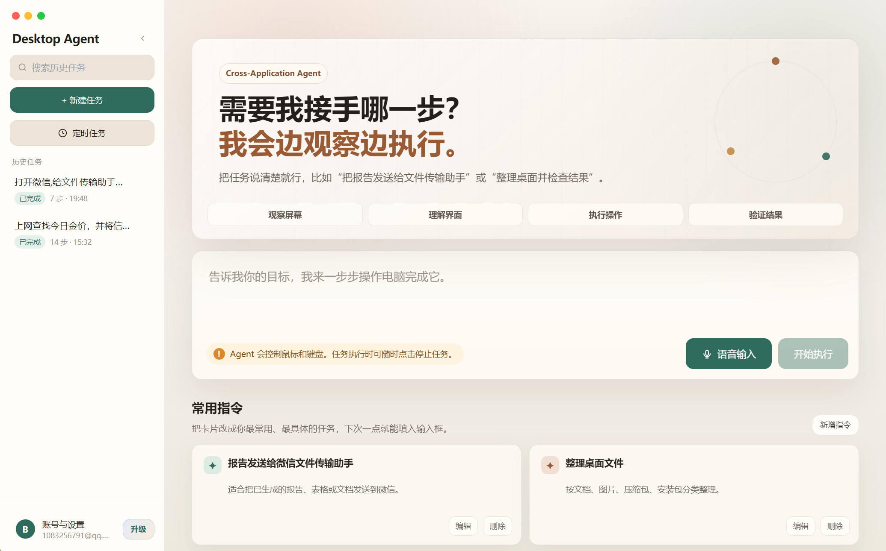
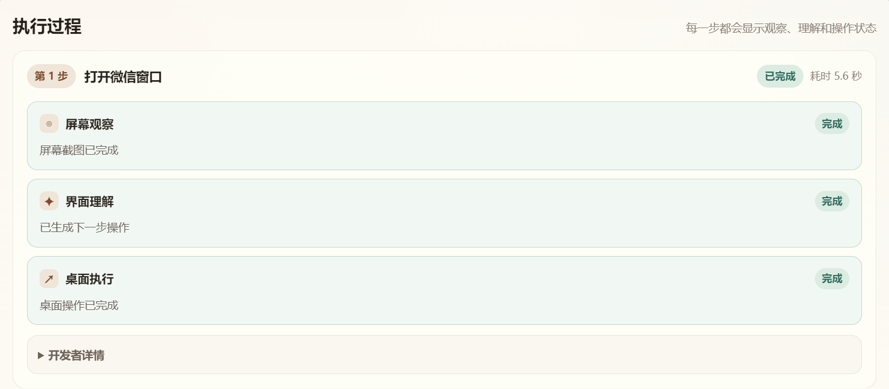

<h1 align="center">📘 跨应用自动化执行 Agent 用户使用指南</h1>

<p align="center">
  <strong>从安装、登录、配置到执行任务的完整使用说明</strong>
</p>

<p align="center">
  
  
  
</p>

---

## 1. 👋 这是什么软件？

跨应用自动化执行 Agent 是一个可以“看懂桌面并操作电脑”的智能助手。你只需要告诉它目标，它会自动观察屏幕、判断下一步动作，并帮你完成跨应用操作。

你可以让它做这些事：

- 🌐 打开浏览器搜索资料；
- 📄 整理内容并生成报告；
- 💬 打开微信、QQ、邮箱发送文件或消息；
- 📁 查找和整理电脑文件；
- ⏰ 设置定时任务自动执行；
- 🎙️ 用语音输入任务指令。

---

## 2. 🧰 安装与启动

### 2.1 安装

找到安装包：

```text
Desktop Agent-1.0.0-Setup.exe
```

双击运行，按安装向导完成安装。

### 2.2 启动

安装完成后，可以通过：

- 桌面快捷方式；
- 开始菜单；
- 安装目录中的 `Desktop Agent.exe`

启动应用。

---

## 3. 👤 注册与登录

首次使用需要注册本地账号。

| 操作 | 说明 |
|---|---|
| 注册账号 | 输入邮箱和密码创建本地账号 |
| 登录账号 | 已注册用户输入邮箱和密码登录 |
| 免登录 | 本地已登录过的用户可自动进入主界面 |
| 退出登录 | 可在“账号与设置”中退出当前账号 |

> 账号主要用于本地数据隔离，不同用户的配置、历史任务和定时任务互不混用。

---

## 4. ⚙️ 配置模型 API

进入：

```text
账号与设置 → API 设置
```

填写：

| 配置项 | 示例 |
|---|---|
| API Key | `sk-xxxxxxxx` |
| Base URL | `https://dashscope.aliyuncs.com/compatible-mode/v1` |
| Model Name | `qwen3-vl-plus` |

保存后即可执行任务。

---

## 5. 🎙️ 配置语音输入

语音输入使用科大讯飞实时语音听写 API。发布版需要在代码中填写语音识别参数并重新打包。

配置文件：

```text
desktop/src/main/speech.ts
```

填写：

```ts
const XFYUN_APP_ID = "你的 AppID";
const XFYUN_API_KEY = "你的 APIKey";
const XFYUN_API_SECRET = "你的 APISecret";
```

配置完成后重新启动应用；如果是安装包发布，需要重新打包。

---

## 6. 🏠 主界面使用

主界面包含：

| 区域 | 作用 |
|---|---|
| 任务输入框 | 输入你希望 Agent 完成的任务 |
| 语音输入按钮 | 点击开始录音，再次点击停止并识别 |
| 开始执行按钮 | 启动当前任务 |
| 常用指令 | 一键填入高频任务，可自定义编辑 |
| 安全提示 | 提醒任务执行时会控制鼠标和键盘 |

<p align="center">
  
</p>

---

## 7. ✍️ 如何写出更容易成功的任务？

建议任务描述包含四个要素：

<p align="center">
  <kbd>目标应用</kbd>
  <span> + </span>
  <kbd>操作内容</kbd>
  <span> + </span>
  <kbd>交付形式</kbd>
  <span> + </span>
  <kbd>目标对象</kbd>
</p>

### 推荐写法

```text
上 Edge 浏览器查看今日金价信息，整理成 docx 报告，保存到桌面，并通过网易邮箱发送给 1083256791@qq.com。
```

```text
打开微信，搜索文件传输助手，将桌面上的金价报告发送过去，并确认文件已出现在会话中。
```

```text
打开 WPS，新建一个文档，写一份关于今日黄金价格走势的简要报告，保存到桌面。
```

### 不推荐写法

```text
帮我弄一下报告。
```

```text
发给他。
```

```text
处理一下这个文件。
```

---

## 8. 🚦 执行过程怎么看？

任务开始后，界面会显示执行时间线。

<p align="center">
  
</p>

每一步通常包含：

| 状态 | 说明 |
|---|---|
| 👁️ 屏幕观察 | Agent 截取屏幕并识别当前状态 |
| ✦ 界面理解 | Agent 判断下一步应该做什么 |
| ↗ 桌面执行 | Agent 操作鼠标、键盘或应用窗口 |
| ✅ 完成 | 当前步骤执行成功 |
| ⚠️ 失败 | 显示失败原因和开发者详情 |

---

## 9. 🟢 悬浮状态球

执行任务时会显示悬浮状态球。

| 操作 | 说明 |
|---|---|
| 拖动状态球 | 按住状态球移动到屏幕任意位置 |
| 点击状态球 | 返回主界面或查看任务状态 |
| 状态变化 | 运行、成功、失败、停止会同步显示 |

透明区域不会拦截鼠标，只有球体本身响应点击和拖动。

---

## 10. ⏰ 定时任务

定时任务适合重复执行的工作。

常见场景：

- 每天查询行业新闻；
- 每周生成固定报告；
- 定时整理文件；
- 定时打开网页并执行检查。

使用方式：

1. 进入定时任务页面；
2. 新建任务；
3. 填写任务名称和任务指令；
4. 设置执行时间或周期；
5. 启用任务。

任务执行中也可以点击停止。

---

## 11. 🛑 如何停止任务？

你可以通过以下方式停止：

| 入口 | 说明 |
|---|---|
| 主界面右上角停止按钮 | 立即停止当前任务 |
| 输入框旁停止按钮 | 执行中可直接停止 |
| 定时任务卡片停止按钮 | 停止当前定时任务执行 |
| 关闭主窗口 | 同时结束后台 Agent 进程 |

停止后，系统会结束 Python 子进程树，避免任务“停了又继续执行”。

---

## 12. 📁 文件与报告在哪里？

Agent 生成的任务产物会优先放到桌面输出目录：

```text
Desktop\AgentOutputs
```

常见产物：

- `.docx` 报告；
- `.txt` 摘要；
- 下载文件；
- 需要发送的附件。

任务结束后，系统会自动清理执行过程截图，避免占用过多磁盘空间。

---

## 13. 🎙️ 语音输入技巧

建议这样说：

```text
上 Edge 浏览器搜索今天的金价信息，然后以 doc 文档的形式发送给微信好友李浩瑜。
```

建议：

- 说话时尽量清晰；
- 一次录音不要过长；
- 避免背景噪音；
- 人名、邮箱、文件名尽量慢一点说；
- 识别后可手动修改输入框内容再执行。

---

## 14. 🧯 常见问题

### 14.1 任务执行很慢怎么办？

可以尝试：

- 确认网络稳定；
- 使用响应更快的模型；
- 任务描述更具体；
- 关闭无关窗口；
- 避免一次性提出过长任务。

### 14.2 为什么 Agent 找不到刚生成的文件？

建议在任务中明确保存位置：

```text
保存到桌面 AgentOutputs 文件夹，然后发送该文件。
```

### 14.3 微信已经打开，为什么不要从桌面图标再打开？

系统会优先检查任务栏活跃窗口。这样可以避免重复打开微信导致出现登录页面。

### 14.4 邮箱或微信被全屏软件挡住怎么办？

Agent 会尝试返回桌面、切换窗口或从任务栏寻找目标应用。

### 14.5 语音识别不准确怎么办？

识别结果会填入输入框。你可以手动修改后再点击“开始执行”。

---

## 15. 🔐 使用安全建议

- 💾 执行任务前保存重要文件；
- 🛑 随时准备点击停止按钮；
- 💳 不建议让 Agent 自动完成支付、转账等高风险操作；
- 🗑️ 删除文件前建议让 Agent 先确认；
- 🔑 不要把 API Key 发给陌生人；
- 🖱️ Agent 执行时尽量不要手动移动鼠标。

---

## 16. ✅ 最佳实践清单

| 检查项 | 建议 |
|---|---|
| 任务是否具体 | 说明应用、动作、对象和结果 |
| 文件是否有路径 | 指定桌面、下载、AgentOutputs 等目录 |
| 联系人是否明确 | 写清微信好友、邮箱地址或 QQ 对象 |
| 是否允许发送 | 发送消息、邮件、附件前确认内容无误 |
| 是否需要停止 | 发现异常及时停止任务 |

---

<p align="center">
  <strong>🎯 把任务说清楚，剩下的交给 Agent。</strong>
</p>

